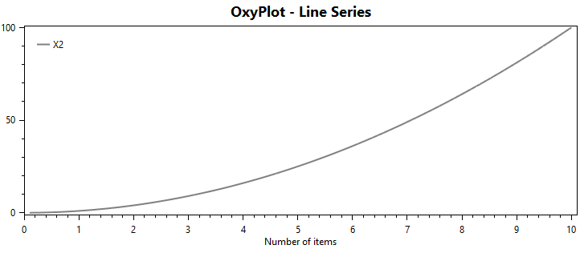

## OxyPlotSeries - hacked from [How to use OxyPlot Diffrent Series in WPF C#](https://csharp.agrimetsoft.com/exercises/OxyPlot_Series)
- Modified to work with SimHub `OxyPlot.Wpf.dll` and `OxyPlot.dll`.
- *SimHub uses version 1.0.0 from 11 Sep 2016*.
 

### OxyPlot Information
- [Web page](https://oxyplot.github.io)
- [Documentation](https://oxyplot.readthedocs.io/en/latest/) 
- [Stack Overflow](https://stackoverflow.com/questions/tagged/oxyplot)

*OxyPlot [GitHub](https://github.com/oxyplot/oxyplot) examples did not build for me*
